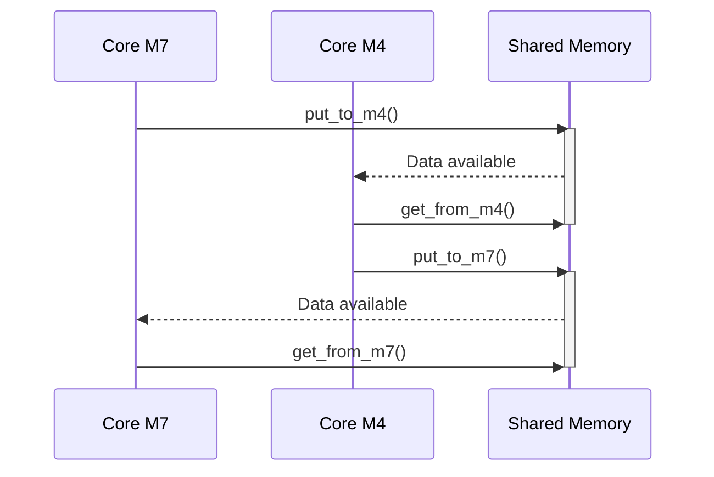
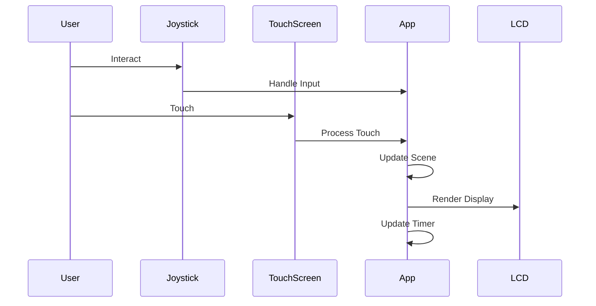

# NFC Utils

The original goal of my project was to create a main control panel for operating a remote-controlled car. I had to change this goal because the STM32H747i-DISCO did not meet the requirements. 

I built the autonomous car on a different platform. 
 
Therefore, I decided to focus on enabling the touch display and communication with an NFC reader peripheral. Specifically, this involves an extension board for Nucleo, the X-NUCLEO-NFC03A1.

The entire project can be found in the repository: https://github.com/petrkucerak/KRP  


## LCD Display

The DISCO board features a built-in display, **B-LCD40-DSI1**, with the **OTM8009A** driver. It supports several modes of operation:

- **Adapted Command Mode (DBI)**: Using the LTDC interface (used in my project).
- **Video Mode (DPI)**: Using the LTDC interface.
- **APB Slave Interface**: Can operate concurrently with either LTDC interface in video or adapted command mode.
- **Video Mode Pattern Generator**: Used for testing.

In my project, I use the **DBI** mode.

> [!NOTE]
> The display serial interface (**DSI**) is part of a group of communication protocols defined by the MIPI® Alliance. 
> Detailed described in the [reference manual](/assets/reference_manual.pdf) in chapt 34 **DSI Host**.

> [!NOTE]
> The LCD-TFT (liquid crystal display - thin film transistor) display controller (**LTDC**) provides a parallel digital RGB (red, green, blue) and signals for horizontal, vertical synchronization, pixel clock and data enable as output to interface directly to a variety of LCD and TFT panels.
> Detailed described in the [reference manual](/assets/reference_manual.pdf) in chapt 33.

#### Adapted command mode on LTDC interface

The adapted command mode, enables the system to input a stream of pixel from the LTDC that is conveyed by DSI Host using the command mode transmission (using the DCS packets). The adapted command mode also supports pixel input control rate signaling and **tearing effect** report mechanism.

> [!NOTE]
> Screen tearing is a visual artifact in video display where a display device shows information from multiple frames in a single screen draw. The artifact occurs when the video feed to the device is not synchronized with the display's refresh rate. (*Source: [Wikipedia](https://en.wikipedia.org/wiki/Screen_tearing)*)

Adapted command mode of operation supports: 16 bpp, 18 bpp, and 24 bpp RGB. In my project I choose 24 bpp.


## X-NUCLEO-NFC03A1

The **X-NUCLEO-NFC03A1** device is designed for reading and editing NFC and RFID devices. Communication is supported via **SPI** or **UART**. In my case, I chose **SPI**.

The device was connected according to the documentation. Note that the Arduino extension pins on the DISCO board have different names compared to those on the Nucleo board.

Unfortunately, I was unable to get this device operational. It was supposed to wake up and start transmitting after a 10 ms logic signal, but this never happened, even after verifying the incoming signal using a simple oscilloscope.

The development branch for this component remains open:  
[GitHub Repository - NFC Reader Development Branch](https://github.com/petrkucerak/KRP/tree/6-nfc-reader).

To facilitate easier debugging for this component, I implemented a **logger** that uses **USART1** to send data to a serial console via **STLINK**.

## X-NUCLEO-NFC07A1

As an alternative, I decided to use a simpler device, **X-NUCLEO-NFC07A1**, which serves as a **dynamic NFC tag**. Communication with this device is much simpler, thanks to the availability of a **BSP component**. 

The device communicates via **I2C** and allows storing various types of information. In my case, I chose to store a link to a web page.

## BSP components

My project includes individual **BSP components** for device communication.

#### List
| name        | source                                                     | description       | used version                              |
| ----------- | ---------------------------------------------------------- | ----------------- | ----------------------------------------- |
| STM32H747i  | https://github.com/STMicroelectronics/stm32h747i-disco-bsp | Library for DISCO | v3.5.1 - latest bring incompatible driver |
| Common      | https://github.com/STMicroelectronics/stm32-bsp-common     | Common component  |
| ft6x06      | https://github.com/STMicroelectronics/stm32-ft6x06         | Touch screen      |
| is42s32800j | https://github.com/STMicroelectronics/stm32-is42s32800j    | SDRAM             |
| otm8009a    | https://github.com/STMicroelectronics/stm32-otm8009a       | LCD               |
| NFC07A1     | https://www.st.com/en/ecosystems/x-nucleo-nfc07a1.html     | NFC dynamic tag   |


## Middleware

For communication with NFC devices, I use the **LIB-NFC7** library, specifically designed for dynamic RFID tags.  
[LIB-NFC7 on GitHub](https://github.com/STMicroelectronics/x-cube-nfc7).

## HAL Libraries

Peripheral communication in my project uses the standard **HAL libraries** from ST. These are located in the `Drivers` directory and are shared between both cores.

## Build System and Initialization

I use **CMake** for building the project. Example commands:

```sh
cmake --build .
cmake --build . && make clean && make  # Universal rebuild snippet
```
> [!WARNING]
> Regeneration code with using STM32CubeMX will damage whole project. So, do not use CubeMX generation.

The repository also includes submodules. To download them, run:

```sh
git submodule update --recursive
```

## Core Task Distribution

The DISCO kit contains two cores: a more powerful **CM7** and a less powerful **CM4**. I distributed the workload as follows:

- **CM7**: Handles resource-intensive operations requiring speed, such as screen control and serial communication.
- **CM4**: Manages NFC operations.

Clock initialization is handled by **CM7**, which then notifies **CM4** via **HSEM** (hardware semaphore) once the initialization is complete.

### Core communication


The cores communicate via **shared memory**, where they can write and read from buffers allocated for each core. 




## Results app

The intended result was an application that would provide a key after pressing the correct sequence of buttons on the display or the correct sequence of joystick directions.

### Schema



The resulting application does not function as expected. While individual components work correctly, the combined system fails to perform as intended. This is likely due to delays in handling the display. In the final implementation, the display failed to meet the required time constraints, forcing me to extend the timeouts. However, these extended timeouts slowed the application to the point of failure.

Despite this, the following components are functional:

- **NFC07A1**
- **LCD Display** (with touch controls)
- **Inter-core Communication**


## Shorts

| name  | description                                        |
| ----- | -------------------------------------------------- |
| BSP   | board support package                              |
| CMSIS | Cortex microcontroller software interface standard |
| LTDC  | LCD TFT display controller                         |
| MSP   | MCU specific package                               |
| SDRAM | SDRAM external memory                              |
| SRAM  | SRAM external memory                               |